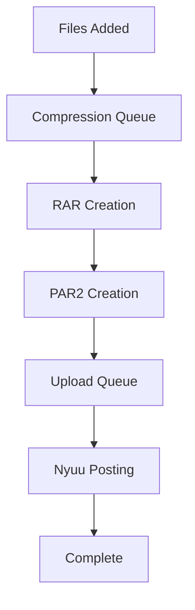

# Queue System Architecture
{: .mb-6 }

NZB Flow uses a sophisticated dual-queue system that allows compression/par2 creation and uploading to run simultaneously, maximizing efficiency and system resource utilization.
{: .lead }

## Architecture Overview
{: .mb-5 }



### General Queue Behavior
{: .mb-4 }

- **Pause/Resume**: Controls both queues simultaneously via UI or API
- **Command Completion**: Running commands (rar, parpar, nyuu) finish before pausing
- **Step-by-Step Control**: Queues can pause between processing steps

---

## Upload Queue
{: .mb-4 }

Handles posting prepared files using the Nyuu CLI.

### Configuration
{: .mb-3 }

| Setting                | Description                          | Impact                                        |
| ---------------------- | ------------------------------------ | --------------------------------------------- |
| **Max Upload Workers** | Concurrent upload processes          | More workers = higher server connection usage |
| **Max Queue Size**     | Auto-pause threshold for compression | Prevents upload queue backlog                 |
{: .table }

### Connection Calculation
```
Total Connections = (Server Connections + Post Check Connections) × Workers
```

> **Example**: 2 workers with 10 server connections + 2 post check connections = 24 total connections
{: .alert .alert-info }

### Auto-Pause Feature
{: .mb-3 }

When **Max uploads in queue** is set (≥1):
- ⏸️ **Pauses compression** when upload queue reaches the limit
- ▶️ **Resumes compression** when uploads are processed
- 🚫 **Disabled** when set to 0

> **Note**: With multiple compression workers, timing may allow one extra job before pause activates
{: .alert .alert-warning }

---

## Compression Queue
{: .mb-4 }

Handles both RAR compression and ParPar operations with configurable worker processes.

### Configuration
{: .mb-3 }

| Setting                     | Default | Description                      |
| --------------------------- | ------- | -------------------------------- |
| **Max Compression Workers** | 1       | Concurrent compression processes |
{: .table }


